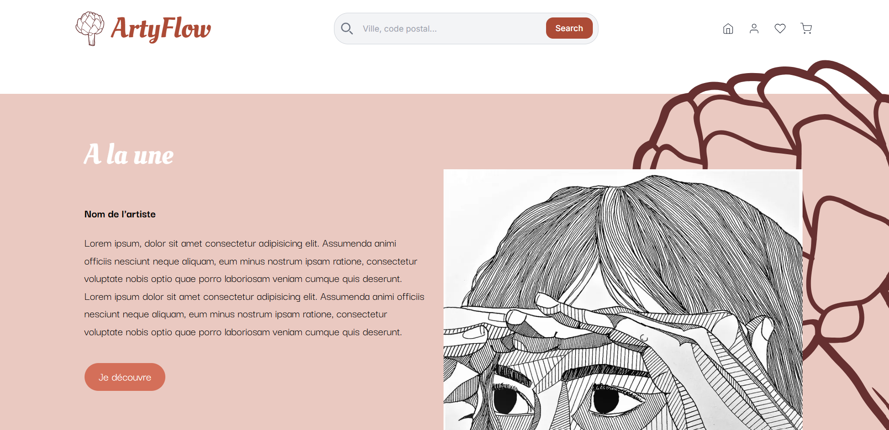

# Artyflow - Project

## Overview

Artyflow is a platform where artists can publish their artwork, and users can explore, favorite, and eventually purchase art. Artists can showcase their bio, and users can filter artworks by style or region. The platform allows easy interaction between artists and art lovers.

### Features

- **User Accounts**: Users can sign up, log in, and create profiles (artists and non-artists).(coming soon)
- **Artwork Submission**: Artists can add, edit, and delete their artwork.(coming soon)
- **Favorites**: Users can add artworks to their favorites.(coming soon)
- **Filters**: Artworks can be filtered by style or region (coming soon).
- **Purchases**: Users will be able to buy artworks (coming soon).

## Tech Stack

- **Next.js**
- **Tailwind**
- **React**
- **Prettier**
- **ESlint**

- **Database**:
  - **PostgreSQL**
  - **Prisma**
